# Stack

# Stack scheme

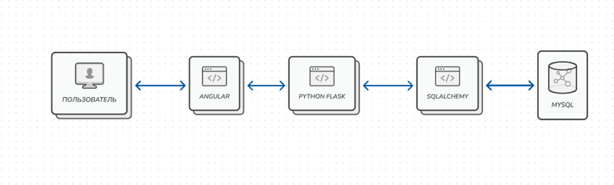

# Database

## (ye, it's kinda cringe)

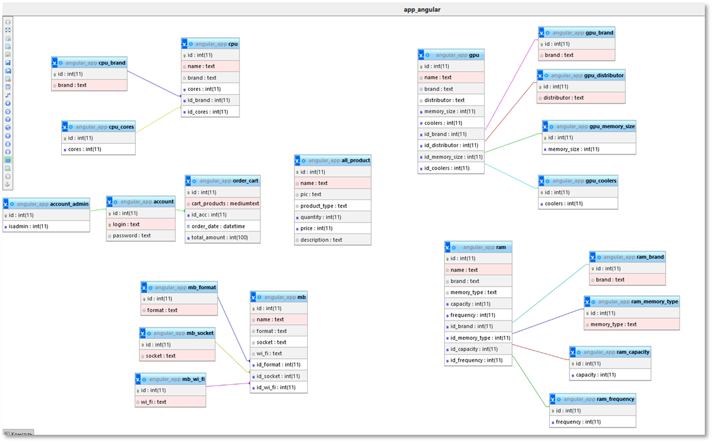

# Forms

## Login & Registration

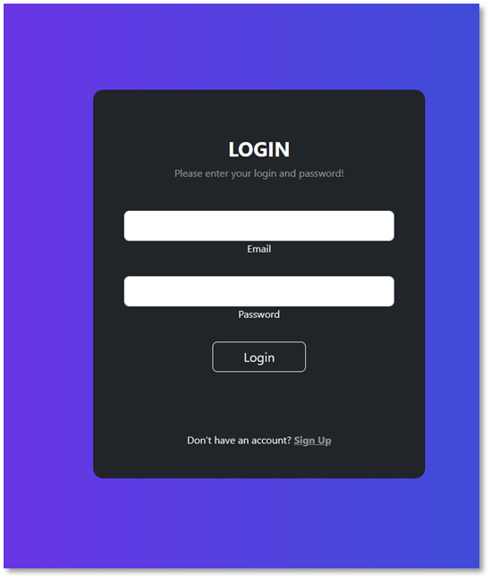 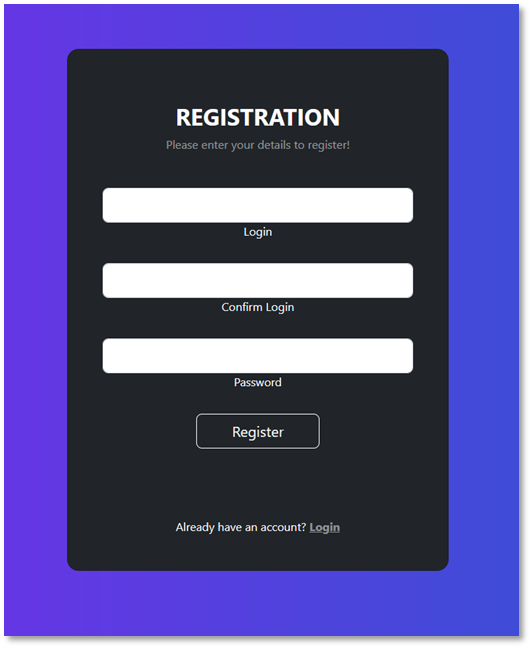

## Main with products

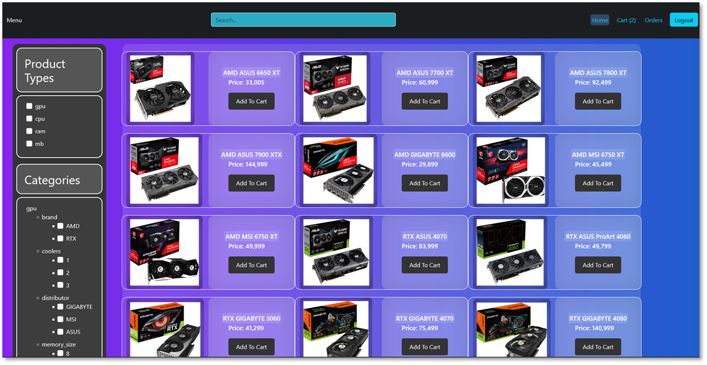

## Sort by search and cats

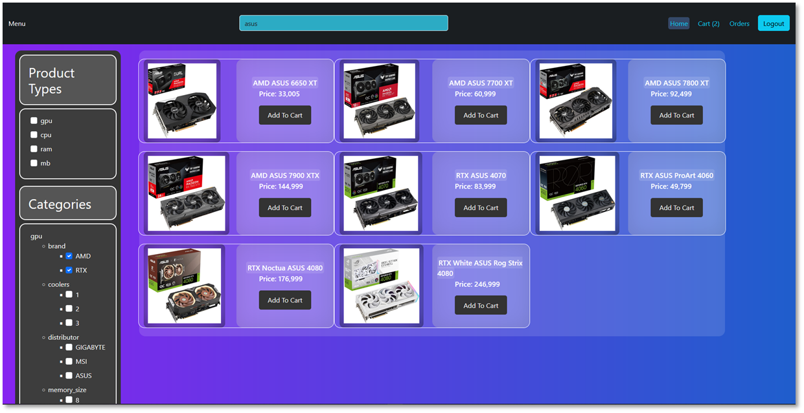

## Cart

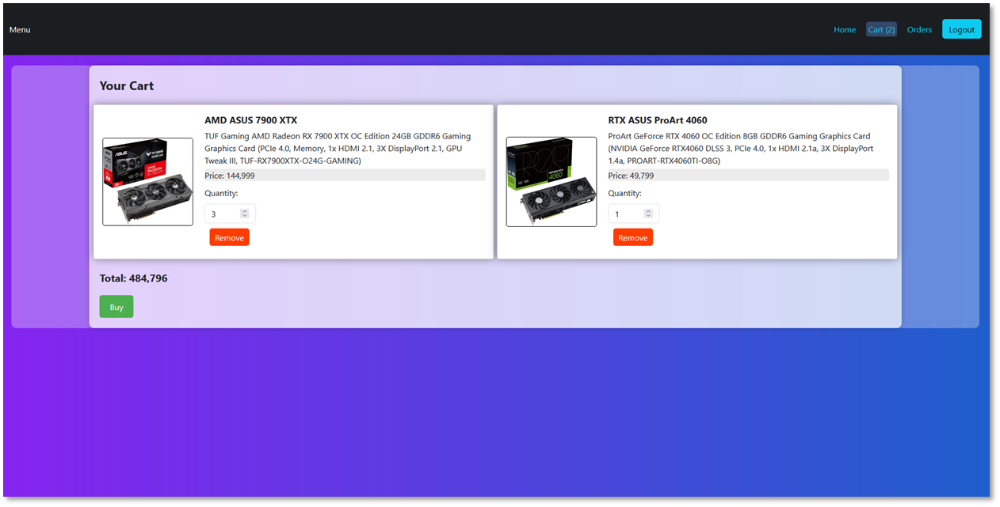

## Orders

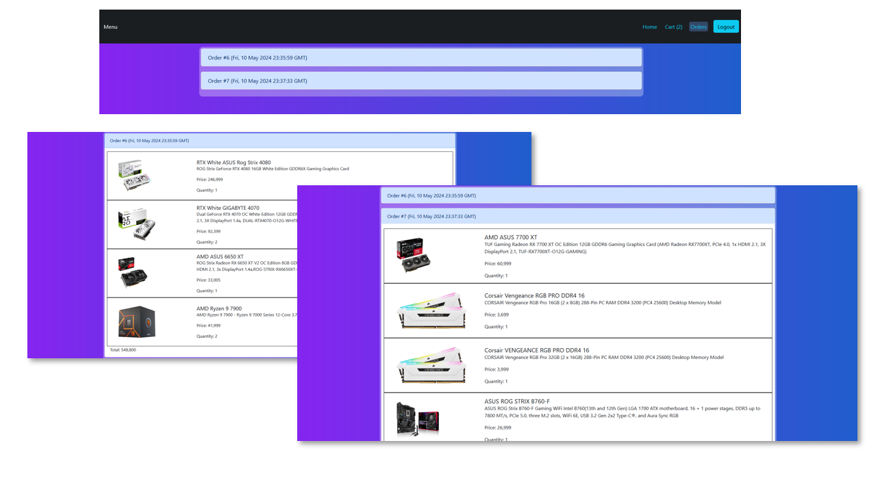

## Admin Menu

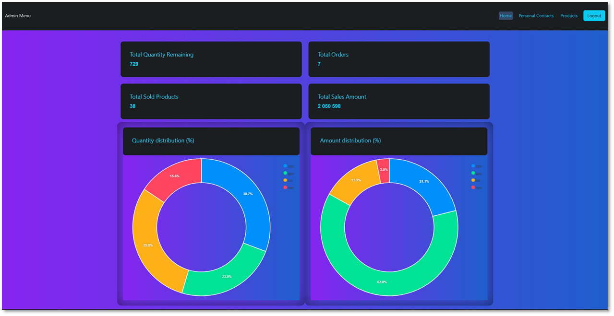

## CRUD

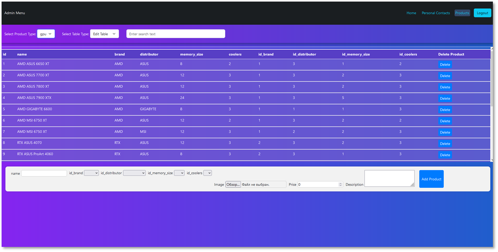

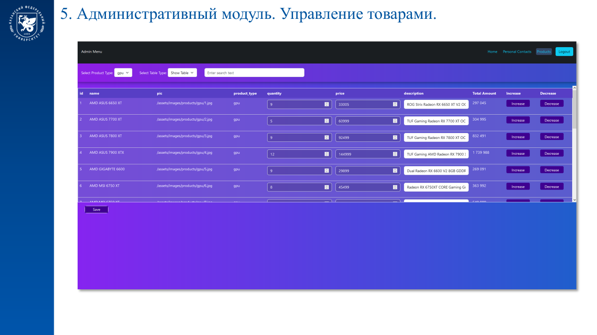
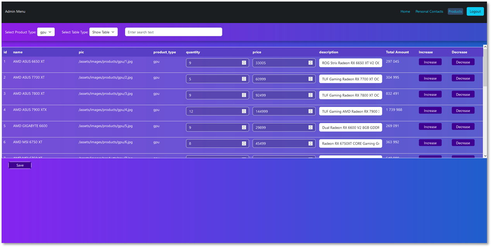

# FirstApp

This project was generated with [Angular CLI](https://github.com/angular/angular-cli) version 16.2.4.

## Development server

Run `ng serve` for a dev server. Navigate to `http://localhost:4200/`. The application will automatically reload if you change any of the source files.

## Code scaffolding

Run `ng generate component component-name` to generate a new component. You can also use `ng generate directive|pipe|service|class|guard|interface|enum|module`.

## Build

Run `ng build` to build the project. The build artifacts will be stored in the `dist/` directory.

## Running unit tests

Run `ng test` to execute the unit tests via [Karma](https://karma-runner.github.io).

## Running end-to-end tests

Run `ng e2e` to execute the end-to-end tests via a platform of your choice. To use this command, you need to first add a package that implements end-to-end testing capabilities.

## Further help

To get more help on the Angular CLI use `ng help` or go check out the [Angular CLI Overview and Command Reference](https://angular.io/cli) page.

## Packages u'll needed: (via pip install)

`SQLAlchemy 2.0.23`
`mysql-connector-python 8.2.0`
`Flask 3.0.0`
`Flask-Cors 4.0.0`
`Flask-RESTful 0.3.10`
`Flask-SQLAlchemy 3.1.1`

## Also u need 'npm concurrently'

`npm install concurrently`

# Start flask & angular

`npm run start:both`

# From package json

"start:angular": "ng serve",
"start:flask": "cd Server_Flask && python app.py",  
"start:both": "concurrently \"npm run start:angular\" \"npm run start:flask\""
